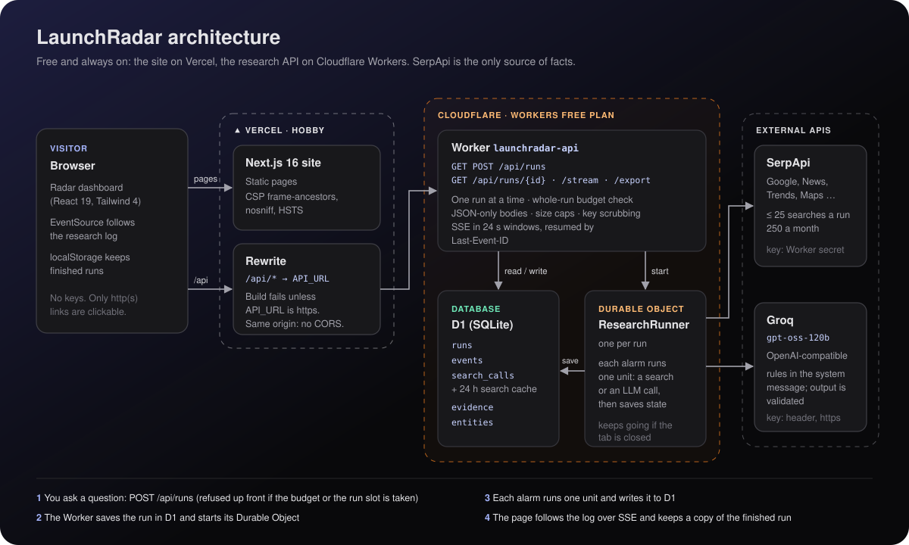

<div align="center">

# 📡 LaunchRadar

**Market signal, with receipts.**

A market question goes in; evidence-backed product opportunities come out.
SerpApi is the **only** source of facts — every claim in the output is traceable
to verbatim quotes pinned to a recorded SerpApi search response (see
`files/LAUNCHRADAR_ARCHITECTURE.md`).

<!-- live -->
[](https://launchradar-psi.vercel.app)
[](https://launchradar-psi.vercel.app)
[](https://launchradar-api.launchradar-worker.workers.dev/api/health)
[](#deploying-site-on-vercel-api-on-cloudflare-workers)
[](#deploying-site-on-vercel-api-on-cloudflare-workers)
[](https://launchradar-psi.vercel.app/v2)
[](https://launchradar-psi.vercel.app/report)

<!-- stack -->
[](https://nextjs.org/)
[](https://react.dev/)
[](https://www.typescriptlang.org/)
[](https://tailwindcss.com/)
[](https://nodejs.org/)
[](https://vercel.com/)
[](https://workers.cloudflare.com/)
[](https://developers.cloudflare.com/d1/)
[](https://developers.cloudflare.com/durable-objects/)
[](https://developers.cloudflare.com/workers/wrangler/)
[](https://serpapi.com/)
[](https://groq.com/)
[](#how-a-run-executes)

<!-- quality -->
[](https://github.com/vardhan23v/launchradar/actions/workflows/ci.yml)
[](#tests)
[](#security)
[](https://github.com/vardhan23v/launchradar/commits/main)
[](https://github.com/vardhan23v/launchradar/commits/main)
[](https://github.com/vardhan23v/launchradar)
[](https://github.com/vardhan23v/launchradar)
[](https://github.com/vardhan23v/launchradar)
[](https://github.com/vardhan23v/launchradar/stargazers)

[Live app](https://launchradar-psi.vercel.app) · [API health](https://launchradar-api.launchradar-worker.workers.dev/api/health) · [Architecture](#architecture) · [Interfaces](#interfaces) · [Setup](#setup) · [Modes](#modes) · [Pipeline](#pipeline) · [Security](#security) · [Project layout](#project-layout) · [Tests](#tests) · [Deploying](#deploying-site-on-vercel-api-on-cloudflare-workers)

</div>

---

## Architecture

<p align="center">
  
</p>

1. **Ask.** The browser posts a question to `/api/runs` on the site's own domain; Vercel rewrites it to the Worker. The
   Worker refuses up front if another run is in progress or the hour or month cannot cover a whole run.
2. **Start.** The Worker saves the run in D1 and starts the run's Durable Object.
3. **Research.** Every alarm of that object does one unit of work, a SerpApi search or a Groq call, and saves the result
   to D1. A closed tab does not stop it.
4. **Follow.** The page streams the research log from `/api/runs/{id}/stream` (server-sent events, resumable), then shows
   the opportunities and keeps a copy of the finished run in the browser.

The diagram source is [`docs/architecture.svg`](docs/architecture.svg).

## Interfaces

Everything linked from the home page uses one design: dark (zinc-950), Geist, indigo actions, emerald for open gaps.

| Page | Route | What it shows |
|---|---|---|
| **Home: the radar** | `/` (old `/v3` links redirect here) | Every opportunity from every finished run in one ranked feed: #1 featured card with the sub-score pentagon, grid/list toggle, sticky filters (research question, gap status, confidence, region, date, shortlist), search with ⌘K / Ctrl+K, sort by score / momentum / newest, a detail panel with numbered source footnotes. |
| **A research run** | `/runs/[id]` | Live progress (seven stages, research log), then the run's opportunities, problems with verbatim quotes, competitors with pricing, rating and complaints, the research log and every search result, plus Markdown export. |

Two earlier designs are still served for anyone with a link, but nothing in the new design links to them:
`/report` and `/report/runs/[id]` (the original print-like report view) and `/v2` (the triage board). The shortlist is shared
between `/`, `/runs/[id]` and `/v2`. The new design lives in `src/components/v3`, `src/lib/v3/feed.ts` and the route group
`src/app/(radar)` with its own stylesheet, so the older views' styles are untouched. See `REDESIGN.md` for the `/v2` record.

## Stack

- **API: a Cloudflare Worker** (TypeScript) in `worker/`. It owns everything server-side: SerpApi access, the LLM calls,
  the pipeline, scoring, persistence, SSE and the Markdown export. Runs live in **D1** (Cloudflare's SQLite), and each
  research run is driven by a **Durable Object** that performs one unit of work (one search, one LLM call) per alarm.
  No dependencies beyond the Workers runtime.
- **Frontend: Next.js 16** (App Router) · TypeScript · Tailwind v4. It holds no server logic and no keys;
  `next.config.mjs` proxies `/api/*` to the Worker.

## Setup

```bash
npm install                 # frontend
npm --prefix worker install # API (wrangler, vitest)
```

Run both, in two terminals:

```bash
npm run api             # the Worker on http://127.0.0.1:8787 (wrangler dev, local D1 + Durable Objects)
```

```bash
npm run dev             # frontend on http://localhost:3000
```

The app runs out of the box with **no keys**: the recorded demo run ("AI tools for college students in India") is listed
on the home page and replays the full research trace over SSE. To research a **new** question locally, create
`worker/.dev.vars` (git-ignored) with `SERPAPI_API_KEY=…` and `LLM_API_KEY=…`; the other settings have defaults in
`worker/wrangler.jsonc` (`SERPAPI_MODE=live`, Groq's OpenAI-compatible endpoint with `openai/gpt-oss-120b`).

## Modes

| `SERPAPI_MODE` | Behaviour                                                    |
| -------------- | ------------------------------------------------------------ |
| `replay`       | Answers only from a fixture source (tests) — a missing fixture fails loudly |
| `live`         | Hits SerpApi; identical params within 24 h come from the D1 cache (default in `wrangler.jsonc`) |

- `SERPAPI_API_KEY` is required for `live`.
- `LLM_PROVIDER` (demo|openai|gemini) selects the LLM backend; `LLM_API_KEY` and
  optional `LLM_MODEL` / `LLM_BASE_URL` / `LLM_REASONING_EFFORT` configure it. Researching a **new** question needs a real
  provider — `demo` only replays the recorded run. The home page says what is missing.
- Budgets are guarded **before** any network cost:
  25 searches per run, 40 billed searches per hour, 250 per calendar month (`RUN_SEARCH_BUDGET`, `HOURLY_SEARCH_GUARD`,
  `MONTHLY_SEARCH_BUDGET`; `0` stops all billed searches). Cache hits and fixture replays are never counted as billed.
  The counters live in D1, so they survive deploys.
- A new run must fit **whole**: it is refused up front unless the hour and the month can still cover its 25 searches,
  so a run never stops halfway after spending LLM calls. Only **one run at a time** is in progress across all visitors
  (`CONCURRENT_RUN_LIMIT`); the home page says when the next one can start.
- Per-run split: discovery 12 (including 2 autocomplete seeds) · trends 2 ·
  competitors 6 · gap verification 5.

## Pipeline

1. **Plan** — classify the question, seed queries from autocomplete, build ~10 discovery queries.
2. **Discover** — up to 12 searches across engines (`google`, `google_news`, `google_trends`, `google_play_product`, …); normalise blocks (organic, related_question, discussion, review, trend_point, …) into evidence rows.
3. **Extract signals** — LLM pulls pain/problem statements; **citation validator** drops any signal whose quote is not a verbatim substring of its cited evidence.
4. **Cluster** — signals grouped into need clusters (weak clusters dropped).
5. **Competitors** — LLM enumerates competitors with evidence-backed complaints.
6. **Verify gaps** — per open cluster: search + classify `served` / `partially-served` / `open`.
7. **Score** — 0–100 weighted opportunity score (pain 30 · momentum 20 · commercial 20 · whitespace 20 · weak rivals 10) + confidence bucket.
8. **Skeptic** — 3 objections per opportunity, each pinned to evidence.

Served gaps never become opportunity cards; they stay on the page as **Crowded**, with the products the kill query found.

Progress streams to the UI as SSE step events (persisted events first, then live ones, resumable via `Last-Event-ID`); each `search_call` shows engine, query, result count, latency, and budget impact.

### How a run executes

`POST /api/runs` creates the run in D1 and starts its Durable Object. Every alarm of that object performs **one unit** of
the pipeline — one search, one LLM call or one bookkeeping step — persists the pipeline state and schedules the next
alarm. Each unit is its own invocation, so it has the free plan's full CPU, subrequest and query budget to itself, and a
browser that closes the tab cannot stop a run. A unit that is retried after a crash finds its search already recorded
(the call id is deterministic) and does not search again.

`GET /api/runs/{id}/stream` replays the persisted log, then follows a running run for up to 24 s (with a `: ping` every
10 s of silence) and closes; the browser's `EventSource` reconnects with `Last-Event-ID`, so no single request ever
follows a ten-minute run. A finished run replays its whole log and the response ends. The recorded example is paced by the
stream itself, so its trace animates.

## Security

LaunchRadar has **no accounts**: anyone who opens the site can start research, and every run (its question, findings
and research log) is visible to every visitor. So the controls protect the operator's spend, the shared database and
the keys, and they keep scraped or model-written text from doing anything but display.

| Area | What is enforced | Where |
|---|---|---|
| Spend | One live run at a time, claimed in one SQL statement; a run is refused unless the hour and month cover its whole search budget; per-run, hourly and monthly search caps checked before every billed search | `worker/src/index.ts`, `store.ts`, `serpapi.ts` |
| Shared database | The recorded example is copied at most 6 times an hour (then the newest copy is reused) and only the newest 10 copies are kept; the run list returns the newest 50; request bodies are capped (16 KiB to start a run, 2 MiB and 2,000 records to export) | `index.ts`, `store.ts`, `export.ts` |
| Keys | Stored only as Worker secrets (never in the repository or the browser); the LLM key travels in a header and only over https; provider error bodies never reach a run, and every message shown publicly or logged is scrubbed of keys; `OPENAI_API_KEY` is only sent to OpenAI | `config.ts`, `llm.ts`, `serpapi.ts`, `pipeline.ts` |
| Untrusted text | Scraped pages and model output are data: prompt rules go in the system message, the evidence block cannot be closed from inside it, every quote must be a verbatim substring of its cited result, model-written fields are length-bounded, competitor links must be pages the competitor was cited from | `prompts.ts`, `llm.ts`, `pipeline.ts`, `citations.ts` |
| Browser | Only absolute http(s) links become clickable (checked on the server and again at every link); React escapes all text; saved runs are shape-checked; CSV cells cannot start a spreadsheet formula; pages send `frame-ancestors 'none'`, `X-Frame-Options`, `nosniff`, a referrer and permissions policy and HSTS | `normalise.ts`, `src/lib/evidence.ts`, `src/lib/history.ts`, `next.config.mjs` |
| Requests | Bodies must be `application/json` (no cross-site form posts); unknown routes and methods are refused before the database is touched; resume ids must be small integers; answers carry `Cache-Control: no-store` | `index.ts` |
| CI | Read-only token, checkout without persisted credentials, actions pinned to commit SHAs | `.github/workflows/ci.yml` |

The code was reviewed with Cloudflare's [security-audit skill](https://github.com/cloudflare/security-audit-skill)
(source review only; no target code was executed). Every issue its hunters reported is fixed above, but the run was
stopped before its independent verification and report stages, so treat it as a partial review rather than a sign-off.
Known trade-offs: the Worker cannot tell individual visitors apart behind Vercel's proxy, so limits are global rather than
per person, and the 10 ms CPU limit of the free plan is the backstop for anything heavier than expected.

## Project layout

```
worker/
  src/
    index.ts       routes: runs, SSE stream, stateless export, health
    runner.ts      Durable Object: one pipeline unit per alarm
    pipeline.ts    the resumable step machine: plan → discover → extract → cluster → trends → competitors → gaps → verify → score
    store.ts       D1 persistence (runs, events, search calls + cache, evidence, entities)
    stream.ts      SSE follow + resume, heartbeats, demo pacing
    serpapi.ts     the ONLY module that reaches SerpApi: budget → cache → call → normalise → persist → event
    engines.ts     region defaults, sha256 param hash, key redaction
    normalise.ts   raw SerpApi JSON → evidence rows (every block optional)
    llm.ts         provider-agnostic JSON-mode client (gemini/openai), one repair retry, 429 patience
    prompts.ts     runtime prompts (IMPLEMENTATION Part C)
    citations.ts   verbatim-quote validator
    score.ts       deterministic 0–100 score (pure function)
    config.ts      settings, engines, regions, budgets, score weights, routing, readiness check
    demo.ts        recorded demo runs
    export.ts      markdown export
  fixtures/demo/   recorded demo run
  test/            vitest inside the Workers runtime: units, API routes, stream, guards, golden pipeline run (stubbed network)
  wrangler.jsonc   the Worker's config: D1 and Durable Object bindings, non-secret settings
  .dev.vars        local secrets for `npm run api` (git-ignored, never committed)
.github/workflows/ci.yml  typecheck + tests for the Worker, typecheck + lint + build for the site
docs/architecture.svg     the architecture diagram shown above
src/
  app/             pages only (home, run, and the /v2 triage board)
  app/v2/lr.css    the triage board's scoped design system (imported only by /v2)
  app/(radar)/     the home page (radar dashboard) and its radar.css: font, page colour, keyframes
  app/(radar)/runs/ the new-design run page
  app/report/      the original report view (home and runs), no longer linked
  components/      HomeClient, RunClient, ui primitives (report view)
  components/v2/   HomeV2, RunV2 hosts + pure HomeScreen, RunScreen, ResearchLog, primitives
  components/v3/   radar dashboard: Dashboard host, TopNav, Cards, FilterPanel, DetailPanel, NewResearchDialog
  lib/types.ts     TypeScript shapes of the API's JSON
  lib/history.ts   finished runs kept in the browser
  lib/v2/          adapter (real API -> view models, prefs) and viewModel (types, exports)
  lib/v3/feed.ts   pure feed logic: runs -> ranked opportunities, filters, facets, source footnotes
```

## Tests

```bash
npm test          # the Worker's 33 vitest tests, run inside the Workers runtime: no network, no quota
npm run typecheck # tsc --noEmit (frontend); npm run typecheck:api for the Worker
npm run lint      # eslint (frontend)
npm run build     # frontend production build
```

## Deploying: site on Vercel, API on Cloudflare Workers

Both are on free plans and neither sleeps.

| Part | Host | Live URL | How it deploys |
|---|---|---|---|
| Site | Vercel (Hobby) | https://launchradar-psi.vercel.app | every push to `main` (Vercel Git integration) |
| API | Cloudflare Workers (Free) | https://launchradar-api.launchradar-worker.workers.dev | `npm run deploy:api` (wrangler), or Workers Builds for push-to-deploy |

The site reaches the API through its own domain: `API_URL` on Vercel names the Worker, and `next.config.mjs` rewrites
`/api/*` to `${API_URL}/api/*`. The browser never talks to the Worker directly, so no CORS is needed, and every API answer
carries `Cache-Control: no-store`, so Vercel's CDN never caches one. A Vercel build **fails** if `API_URL` is missing or is
not an `https://` origin, so a misconfigured site cannot go live.

### API: first-time setup on Cloudflare

```bash
cd worker
npx wrangler login                    # once, in the browser
npx wrangler d1 create launchradar    # put the printed database_id in wrangler.jsonc (already done for this repo)
npm run deploy                        # wrangler deploy; prints the workers.dev URL
npx wrangler secret put SERPAPI_API_KEY
npx wrangler secret put LLM_API_KEY   # paste each key when asked; nothing is echoed or written to a file
```

The tables are created by the Worker on first use; there is no migration step. `npx wrangler secret bulk .dev.vars` uploads
both keys from the git-ignored local file instead. Change a key later with the same command or in the dashboard
(Worker → Settings → Variables and Secrets); the next request uses it. For deploy-on-push, connect the repository under
Workers & Pages → the Worker → Settings → Builds, with root directory `worker` and deploy command `npm ci && npx wrangler deploy`.

Settings (all optional; non-secret ones live in `worker/wrangler.jsonc` under `vars`):

| Name | Default | Meaning |
|---|---|---|
| `SERPAPI_API_KEY`, `LLM_API_KEY` | — | **secrets**: the two keys a new question needs |
| `SERPAPI_MODE` | `live` | `replay` serves fixtures only (tests) |
| `LLM_PROVIDER` / `LLM_BASE_URL` / `LLM_MODEL` / `LLM_REASONING_EFFORT` | `openai` / Groq / `openai/gpt-oss-120b` / `low` | any OpenAI-compatible gateway over https, or `gemini` |
| `RUN_SEARCH_BUDGET` | `25` | searches one run may use |
| `HOURLY_SEARCH_GUARD` / `MONTHLY_SEARCH_BUDGET` | `40` / `250` | billed searches per hour / calendar month; `0` stops spending |
| `CONCURRENT_RUN_LIMIT` | `1` | live runs in progress at once, across all visitors |
| `DEMO_RUNS_PER_HOUR` | `6` | fresh copies of the recorded example per hour before the newest is reused |
| `CACHE_TTL_HOURS` | `24` | identical searches inside this window are served from D1 for free |

### Site: point Vercel at the API

Vercel → Project Settings → Environment Variables → `API_URL` = `https://launchradar-api.launchradar-worker.workers.dev`
(no trailing slash, no `/api`), then **Redeploy**: rewrites are fixed when the site is built. The LLM and SerpApi keys are
not needed on Vercel.

The API previously ran on Render's free plan, which slept after 15 idle minutes; that service is no longer used and can be
suspended or deleted in the Render dashboard.

### What the free plans give

- **Workers**: 100,000 requests a day, 10 ms of CPU per request (waiting on SerpApi or the LLM does not count), no
  sleeping, no cold start to speak of. A run uses about 60 invocations.
- **D1**: 5 million rows read and 100,000 rows written a day, 5 GB. A run writes about 500 rows.
- **Durable Objects**: 100,000 requests and 13,000 GB-seconds a day; a ten-minute run costs about 75 GB-seconds.
- **SerpApi**: 250 searches a month on the free plan, which the monthly guard mirrors — about ten runs.

## Recording a new demo run

Run research for a question on a local Worker with real keys, export the run as JSON from `GET /api/runs/{id}`, add the
`events` from `GET /api/runs/{id}/stream`, save it as `worker/fixtures/demo/<slug>.json` and add the slug to `DEMOS` in
`worker/src/demo.ts`.

## Deviations from the design docs

- **A Cloudflare Worker instead of Next.js route handlers** — the design docs specify a single Next.js deployable; the backend is a separate deployable so it can run on an always-on free host. Module boundaries follow ARCH §8 one to one.
- **D1 (SQLite) instead of Prisma** — plain SQL in `store.ts`; the schema is created by the Worker on first use.
- **SerpApi client uses fetch directly** (not the official `serpapi` package) to keep the payload → evidence pipeline fully under our control.
- **Validation is hand-written** rather than zod models: each LLM stage has a small validator that drops malformed items and fails the stage loudly when the shape is unusable.
- **No shadcn/ui** — the UI is a small set of token-driven primitives in `src/components/ui.tsx` (light + dark, motion and shadows all from CSS variables in `globals.css`).
- **Raw SerpApi JSON is not persisted** — only normalised rows plus `search_metadata.id`, to keep the database small.
- **Review engines that need a product id** (`google_play_product`, `apple_reviews`, `google_maps_reviews`) are typed and normalised but not yet called by the pipeline.

See `CHANGES.md` for what was fixed against the design docs.

---

<div align="center">

Every claim carries the exact words it came from. 📡

</div>
